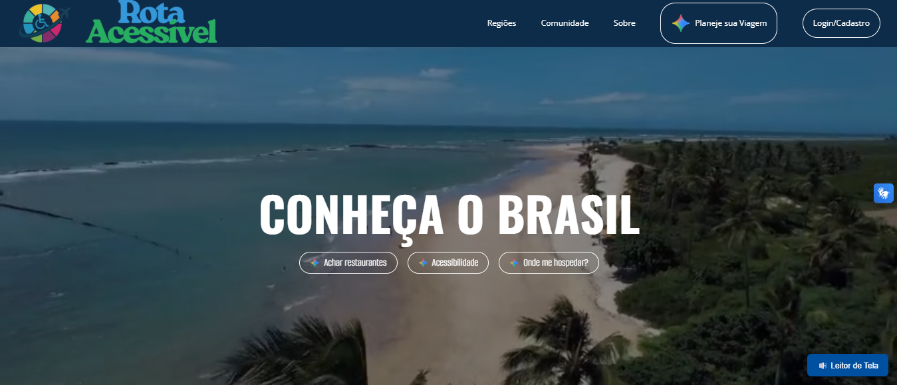

## Rota Acessível 🌍✈️

Um projeto voltado para promover o turismo inclusivo e acessível para pessoas com deficiência (PCDs).
Nosso objetivo é mapear locais e serviços que oferecem acessibilidade, incentivando um turismo mais justo e democrático.

  

## Objetivo 🎯

Facilitar o acesso de pessoas com deficiência a informações claras sobre turismo acessível, além de sensibilizar empresas e a sociedade para a importância da inclusão.

## Autores 👥

- [Lucas Lopes](https://www.linkedin.com/in/lucaslopesfreire/)
- [Guilherme Peixoto](https://www.linkedin.com/in/guilherme-peixoto-dev/)
- [Marcos Augusto](https://www.linkedin.com/in/marcos-augusto-591019342/)
- [Mayara Vitória](https://www.linkedin.com/in/mayaravdsilva/)
- [Nicolas Coelho](https://www.linkedin.com/in/nicolascoelho/)
- [Victor Hugo](https://www.linkedin.com/in/desenvolvedor-victor-almeida/)

